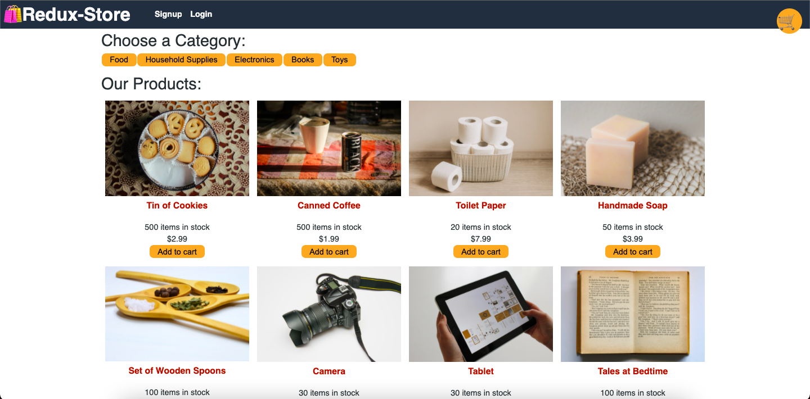

# shop-redux
E-commerce platform using Redux for state management. Users can browse products by category, add products to cart, and sign up or log in to check out using credit card via Stripe payment platform. The website also has offline functionalities to allow users to see products when the internet is down.

## Technologies
* React
* Redux
* JavaScript
* MongoDB
* Apollo GraphQL
* Express.js
* Heroku
* Serviceworker
* IndexDB
* JWT

## Screenshot

    </img>

## Deployed App
https://minhha-redux-store.herokuapp.com/

## GitHub Repo
https://github.com/minhhap/shop-redux